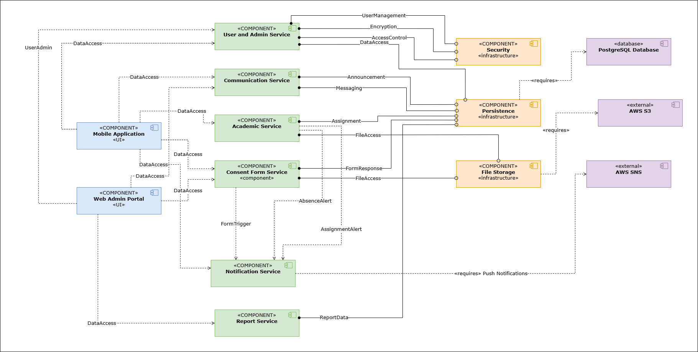

# VidyaConnect Component Diagram

## Overview

This folder contains the high-level component architecture of the VidyaConnect system.

The diagram illustrates:

- Client applications
  - Mobile Application
  - Web Admin Portal
- Core business services
  - User and Admin Service
  - Communication Service
  - Academic Service
  - Consent Form Service
  - Notification Service
  - Report Service
- Infrastructure components
  - Security
  - Persistence
  - File Storage
- External services
  - PostgreSQL Database
  - AWS S3
  - AWS SNS

It also shows the interactions between services, infrastructure components, and external systems.

## Component Diagram

## Editable Source

The editable Draw.io diagram can be found in this folder (if included).

## Google Drive

The latest shared version is available here:

https://drive.google.com/file/d/1xxNKl1LF9nTAQm4jUJBlWxwracrClNgf/view?usp=sharing
