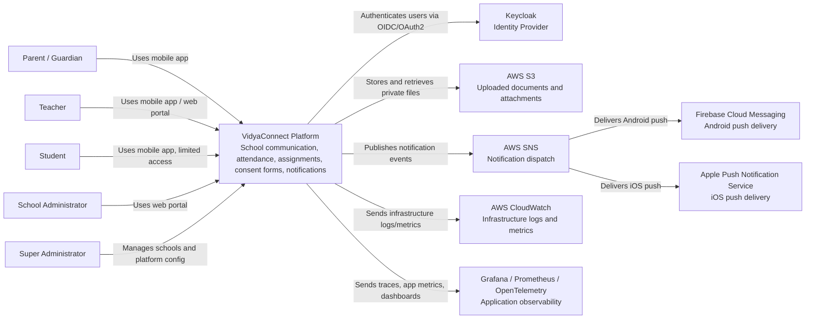
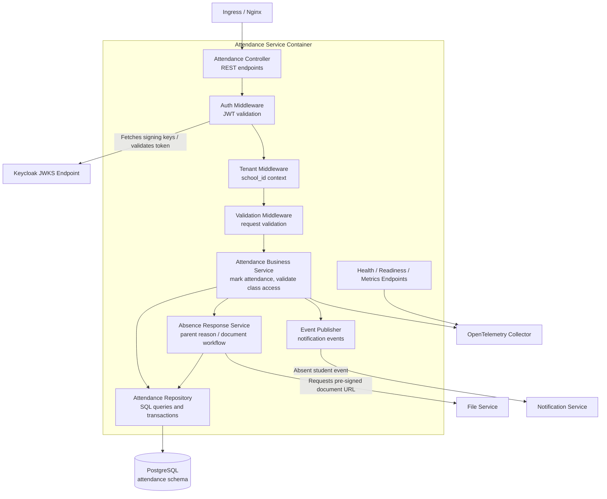
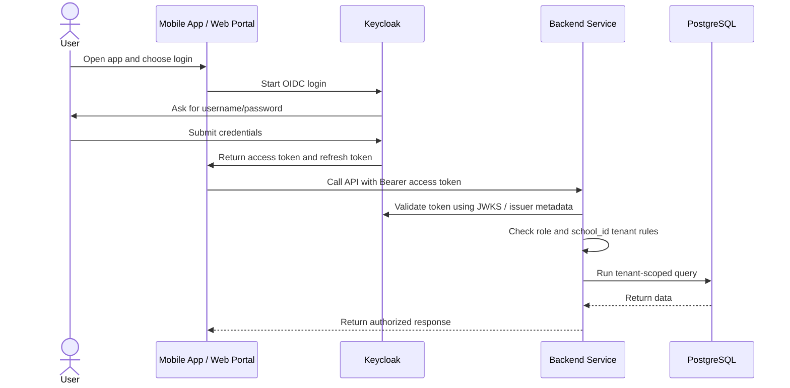
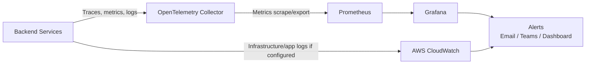
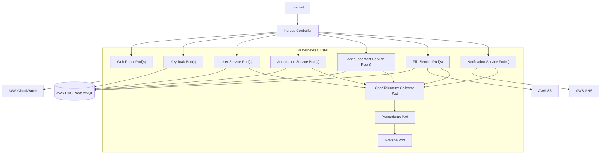

# Sample C4 Architecture For VidyaConnect

Purpose: provide a reference C4 structure for students when correcting the VidyaConnect architecture document and diagrams.

This is a sample, not the final architecture. Students should adapt it to the agreed SRS, implementation scope, and deployment decisions.

## C4 Diagram Rules

Use the C4 levels clearly:

- C1 System Context: users, VidyaConnect as one system, and external systems.
- C2 Container: deployable/runnable parts of the system.
- C3 Component: internal parts of one selected container/service.
- C4 Code: classes/functions for one small implementation area only.

Do not mix levels. For example, do not put repository classes in a C2 container diagram.

## C1 - System Context Diagram

This diagram shows who uses VidyaConnect and which external systems it depends on.



## C2 - Container Diagram

This diagram shows deployable containers and managed services.

For the target architecture, services may run on Kubernetes. For the foundation/local setup, the same containers can run using Docker Compose.

```mermaid
flowchart TB
    subgraph users["Users"]
        parent["Parent / Guardian"]
        teacher["Teacher"]
        student["Student"]
        schoolAdmin["School Administrator"]
        superAdmin["Super Administrator"]
    end

    subgraph clients["Client Applications"]
        mobile["Mobile App\nReact Native / Expo\nAndroid-first"]
        web["Web Admin Portal\nNext.js container"]
    end

    subgraph edge["Edge / Routing"]
        ingress["Ingress Controller / Nginx\nHTTPS termination and route forwarding"]
    end

    subgraph auth["Identity"]
        keycloak["Keycloak\nOIDC/OAuth2 Identity Provider"]
        keycloakDb[("Keycloak PostgreSQL DB")]
    end

    subgraph k8s["Kubernetes Cluster / Container Runtime"]
        userSvc["User and School Service\nNode.js / Express"]
        announcementSvc["Announcement Service\nNode.js / Express"]
        attendanceSvc["Attendance Service\nNode.js / Express"]
        assignmentSvc["Assignment Service\nNode.js / Express"]
        consentSvc["Consent Form Service\nNode.js / Express"]
        fileSvc["File Service\nNode.js / Express"]
        notificationSvc["Notification Service\nNode.js / Express"]
        reportSvc["Report Service\nNode.js / Express"]
    end

    subgraph data["Data Stores"]
        appDb[("AWS RDS PostgreSQL\nApplication data\nService-owned schemas")]
        s3["AWS S3\nPrivate file storage"]
    end

    subgraph notifications["Notification Delivery"]
        sns["AWS SNS"]
        fcm["Firebase Cloud Messaging"]
        apns["Apple Push Notification Service"]
    end

    subgraph observability["Observability"]
        otel["OpenTelemetry Collector"]
        prometheus["Prometheus"]
        grafana["Grafana"]
        cloudWatch["AWS CloudWatch"]
    end

    parent --> mobile
    teacher --> mobile
    teacher --> web
    student --> mobile
    schoolAdmin --> web
    superAdmin --> web

    mobile -->|"HTTPS REST API + Bearer JWT"| ingress
    web -->|"HTTPS REST API + Bearer JWT"| ingress

    mobile -->|"Login / refresh token"| keycloak
    web -->|"Login / refresh token"| keycloak
    keycloak --> keycloakDb

    ingress --> userSvc
    ingress --> announcementSvc
    ingress --> attendanceSvc
    ingress --> assignmentSvc
    ingress --> consentSvc
    ingress --> fileSvc
    ingress --> notificationSvc
    ingress --> reportSvc

    userSvc -->|"Reads/writes own schema"| appDb
    announcementSvc -->|"Reads/writes own schema"| appDb
    attendanceSvc -->|"Reads/writes own schema"| appDb
    assignmentSvc -->|"Reads/writes own schema"| appDb
    consentSvc -->|"Reads/writes own schema"| appDb
    reportSvc -->|"Reads reporting views / service APIs"| appDb

    fileSvc -->|"Stores metadata"| appDb
    fileSvc -->|"Pre-signed upload/download URLs"| s3
    consentSvc -->|"Requests document upload/download"| fileSvc
    attendanceSvc -->|"Requests absence letter/MC upload"| fileSvc

    attendanceSvc -->|"Publishes absence notification event"| notificationSvc
    announcementSvc -->|"Publishes announcement notification event"| notificationSvc
    assignmentSvc -->|"Publishes assignment reminder event"| notificationSvc
    consentSvc -->|"Publishes consent reminder event"| notificationSvc
    notificationSvc --> sns
    sns --> fcm
    sns --> apns

    userSvc --> otel
    announcementSvc --> otel
    attendanceSvc --> otel
    assignmentSvc --> otel
    consentSvc --> otel
    fileSvc --> otel
    notificationSvc --> otel
    reportSvc --> otel
    otel --> prometheus
    prometheus --> grafana
    k8s --> cloudWatch
```



## C2 Container Responsibilities

| Container | Responsibility |
| --- | --- |
| Mobile App | Parent, teacher, and student mobile access. Stores tokens securely and calls backend APIs. |
| Web Admin Portal | School admin, teacher, and super admin browser interface. |
| Ingress / Nginx | Routes `/api/v1/...` traffic to the correct backend service. Handles HTTPS at the edge. |
| Keycloak | Handles login, password reset, sessions, refresh tokens, and token issuing. |
| User and School Service | Schools, users, roles, guardians, students, teachers, class membership. |
| Announcement Service | School-wide and class-level announcements. |
| Attendance Service | Daily attendance, absent/late status, parent absence responses. |
| Assignment Service | Homework/assignment feed, deadlines, completion status. |
| Consent Form Service | Digital consent forms, responses, reminders. |
| File Service | File metadata, S3 pre-signed URLs, file access authorization. |
| Notification Service | Notification preferences, notification log, SNS publishing. |
| Report Service | Dashboard and reporting summaries. |
| AWS RDS PostgreSQL | Main relational database. Prefer service-owned schemas for foundation. |
| AWS S3 | Private object storage for uploaded documents. |
| AWS SNS | Notification dispatch layer to FCM/APNs. |
| OpenTelemetry / Prometheus / Grafana | Application traces, metrics, dashboards, and alerts. |
| CloudWatch | AWS infrastructure logs, metrics, and alarms. |

## C3 - Component Diagram Example: Attendance Service

This diagram zooms into one service. Other services should follow a similar internal structure.



## C3 Component Responsibilities - Attendance Service

| Component | Responsibility |
| --- | --- |
| Attendance Controller | Exposes REST endpoints such as mark attendance, get history, submit absence reason. |
| Auth Middleware | Validates Keycloak JWT signature, expiry, issuer, and audience. |
| Tenant Middleware | Extracts `school_id` and attaches tenant context to the request. |
| Validation Middleware | Validates request body, params, and query strings. |
| Attendance Business Service | Enforces teacher/class access rules and attendance business rules. |
| Absence Response Service | Handles parent absence reason and optional document workflow. |
| Attendance Repository | Performs tenant-scoped database reads/writes. |
| Event Publisher | Sends notification events to Notification Service. |
| Health / Metrics Endpoints | Exposes `/health`, `/ready`, and `/metrics`. |

## Authentication Flow



## Observability Flow



## Deployment Progression

The team should not start directly with Kubernetes implementation if the foundation is not ready. Use this progression:

```text
Step 1: Local Docker Compose
Step 2: Simple EC2 container deployment with Nginx
Step 3: Kubernetes target architecture
```

## Kubernetes Target View



## Disaster Recovery And Backup Notes

The final architecture document should include:

- RDS automated backups.
- Point-in-time recovery target, if supported by the selected setup.
- Manual backup/export before risky migrations.
- S3 versioning for uploaded documents.
- Private S3 buckets with access through pre-signed URLs only.
- Restore procedure for database and files.
- RTO and RPO definitions.
- Failure scenarios for service, node, database, and object storage outages.

Example:

```text
RTO: The system should be restored within 4 hours after a major outage.
RPO: The system should lose no more than 24 hours of data in the worst case.
```

## Common Mistakes To Avoid

- Do not show one `Backend REST API` container if the text says microservices.
- Do not show Keycloak only as a database or utility. It is an external identity provider/container.
- Do not put classes, repositories, or methods in C1/C2 diagrams.
- Do not connect mobile/web apps directly to databases or S3.
- Do not make all services share one vague repository component in the diagram.
- Do not forget tenant isolation on every service and database query.
- Do not claim SNS replaces FCM/APNs completely. SNS dispatches through platform push providers.
- Do not ignore health checks, metrics, logs, and alerts.

