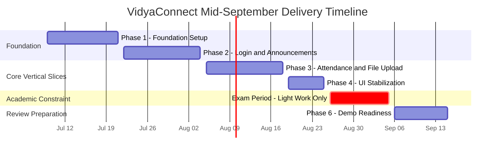
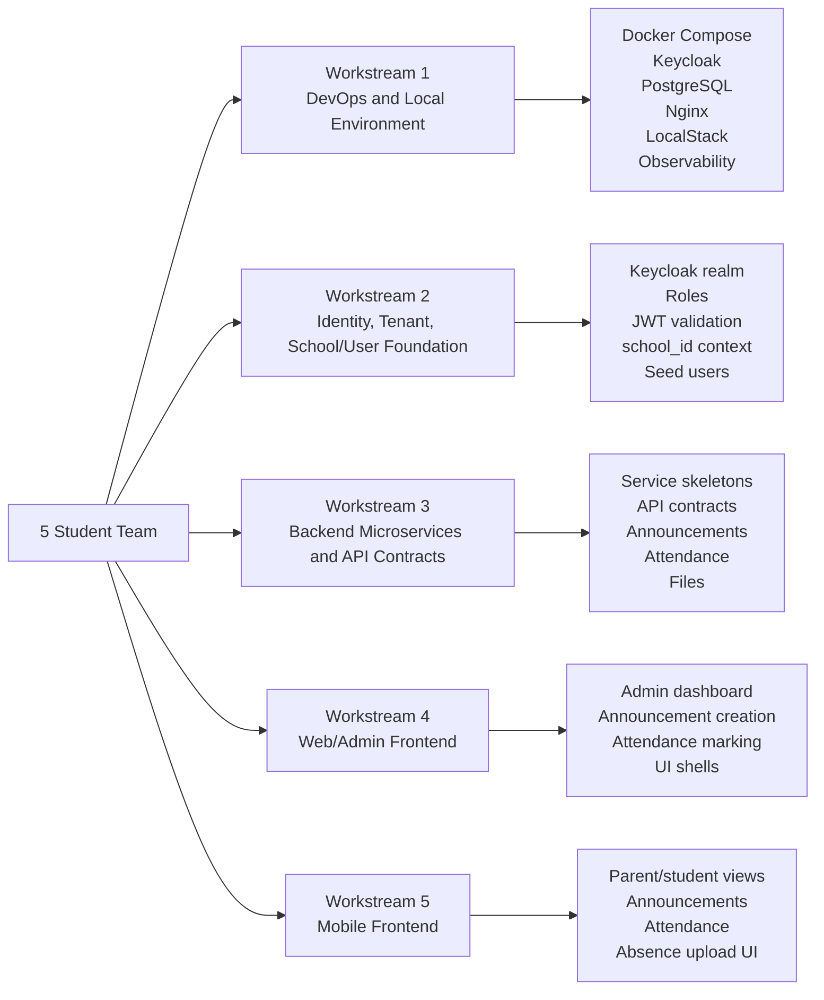
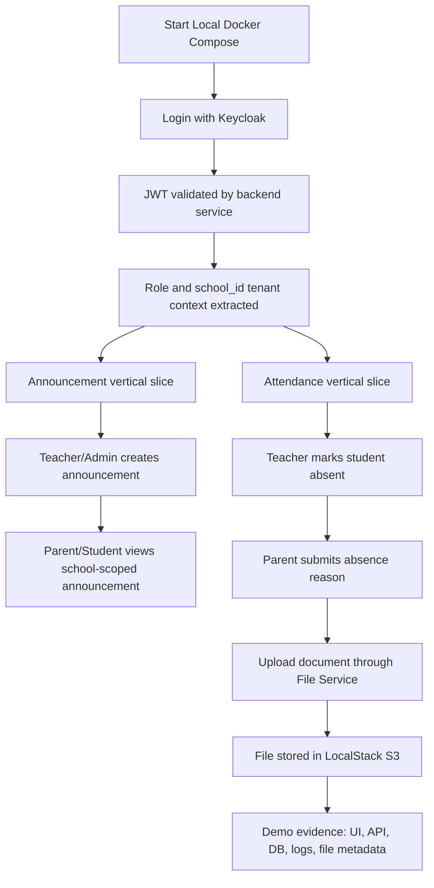
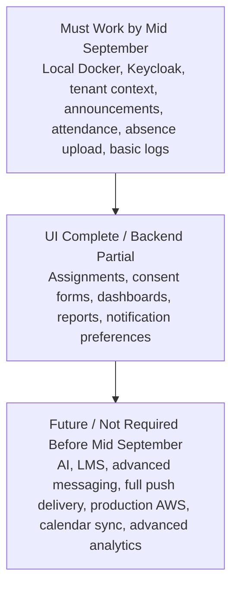

# VidyaConnect Project Plan - Mid September 2026 Delivery

Prepared by: Ishan Liyanage  
Date: 2026-07-09  
Purpose: define a practical delivery plan for interim readiness by mid September 2026

## 1. Project Reality

The interim guide expects:

```text
Individual logbook evidence, clear personal contribution, and demonstrable project progress
```

Current date:

```text
2026-07-09
```

Important constraint:

```text
Semester exams are expected around end August 2026.
```

This means the team does not really have 9-10 full working weeks. Realistically, the team has around 6-7 useful implementation weeks before the exam period reduces availability.

The plan must therefore be pragmatic. The team should not try to build every module deeply before mid September.

## 2. Delivery Strategy

The mid September target should be treated as:

```text
Complete UI coverage + working core vertical slices + credible architecture foundation
```

The goal is not to finish every feature completely. The goal is to prove that the platform architecture, authentication, tenant isolation, frontend, backend services, local deployment, and key user flows work.

## 3. Project Plan Diagrams

### 3.1 Phase Timeline



### 3.2 Workstream Ownership Map



### 3.3 Core Vertical Slice Flow



### 3.4 Scope Priority Map



## 4. Definition of Interim Readiness

For this project, interim readiness by mid September should mean:

- UI readiness for main modules
- local Docker Compose environment working
- Keycloak authentication working
- tenant-aware user/school context working
- microservices skeleton established
- API contracts v1 created
- login flow working
- announcements vertical slice working end to end
- attendance vertical slice working end to end
- basic file upload using LocalStack S3 working
- basic observability visible locally
- documentation updated enough to explain architecture and implementation progress

This is a realistic and defensible interim milestone.

## 5. What UI Readiness Means

UI readiness does not mean every screen must be fully integrated with backend logic.

For mid September, UI readiness should mean:

- all main user roles have screens
- main navigation is complete
- key workflows are visually represented
- forms, lists, dashboards, and detail pages exist
- UI is clickable/demoable
- integrated flows are clearly distinguished from mock/stub flows

### Required UI Coverage

Mobile app:

- login
- parent dashboard
- student dashboard or student view
- announcements
- assignments
- attendance history
- absence reason/document upload
- consent forms
- notifications

Web/admin portal:

- login
- admin dashboard
- school/user/class management shell
- announcement creation
- assignment creation shell
- attendance marking
- consent form creation shell
- file/document view
- basic reports/dashboard

## 6. Scope Classification

### Must Be Working by Mid September

These should be integrated and demonstrable:

- local Docker Compose environment
- Keycloak login
- JWT validation
- role extraction
- `school_id` / tenant context
- school/user foundation service basics
- announcement creation and viewing
- attendance marking
- absence reason submission
- LocalStack S3 file upload for absence document
- basic logs and health checks

### UI Complete but Backend Can Be Partial

These should have UI screens, but backend can be stubbed or partially integrated:

- assignments
- consent forms
- basic dashboards
- notification preferences
- reports
- user/class management advanced actions

### Not Required by Mid September

These should not consume major implementation time before mid September:

- AI Assistant / RAG
- LMS integration
- advanced analytics
- production AWS deployment
- full push notification delivery to real devices
- complex parent-teacher messaging
- full calendar sync/export
- full observability alerting
- payment features
- library module
- health records
- discipline records

## 7. Technical Direction

The project should follow the agreed technical direction:

- microservices-oriented backend
- Docker Compose for local development
- Keycloak as Identity Provider
- PostgreSQL for local database
- LocalStack for AWS-like local services
- Nginx as local reverse proxy / lightweight API gateway
- React Native mobile app
- Next.js web/admin frontend
- AWS RDS PostgreSQL for later cloud deployment
- AWS S3 for later file storage
- AWS SNS for notification dispatch later
- CloudWatch + Grafana/OpenTelemetry for observability

Important rule:

```text
Nothing is considered ready for AWS until it runs locally using Docker Compose.
```

## 8. Team Workstreams

The team has five students. The work should be divided by ownership, but everyone must understand the full flow.

### Workstream 1: DevOps and Local Environment

Responsibilities:

- Docker Compose
- Keycloak container
- PostgreSQL container
- LocalStack
- Nginx routing
- environment files
- local startup guide
- basic observability containers

Primary milestone:

```text
Team can run the platform locally from one command.
```

### Workstream 2: Identity, Tenant, and School/User Foundation

Responsibilities:

- Keycloak realm setup
- roles and sample users
- JWT validation
- tenant context extraction
- school/user service
- seed data
- cross-school access checks

Primary milestone:

```text
Authenticated users have role and school context.
```

### Workstream 3: Backend Microservices and API Contracts

Responsibilities:

- API contracts v1
- service skeletons
- announcement service
- attendance service
- file service
- service health endpoints
- service-level logs

Primary milestone:

```text
Core backend services support first vertical slices.
```

### Workstream 4: Web/Admin Frontend

Responsibilities:

- web/admin layout
- admin login
- dashboard shell
- create announcement screen
- attendance marking screen
- consent/assignment UI shells
- integration with backend for announcement and attendance flows

Primary milestone:

```text
Admin/teacher can demonstrate core workflows from the browser.
```

### Workstream 5: Mobile Frontend

Responsibilities:

- mobile navigation
- login
- parent/student dashboards
- announcement feed
- attendance view
- absence reason upload UI
- assignment/consent UI shells

Primary milestone:

```text
Parent/student can demonstrate the main mobile experience.
```

## 9. Timeline

### Phase 1: Foundation Setup

Dates:

```text
2026-07-09 to 2026-07-21
```

Focus:

- finalize corrected documentation
- API contracts v1
- repo structure
- Docker Compose local environment
- Keycloak local setup
- PostgreSQL local setup
- service skeletons
- UI navigation/screen skeletons

Expected outputs:

- local environment starts
- Keycloak accessible
- PostgreSQL accessible
- basic service `/health` endpoints
- API contracts draft
- UI shell visible

### Phase 2: First Vertical Slice

Dates:

```text
2026-07-22 to 2026-08-04
```

Focus:

- login flow
- JWT validation
- tenant context
- school/user profile
- announcement service
- web-admin create announcement
- mobile announcement feed
- basic audit log

Expected outputs:

- user can log in
- system knows user role and school
- School Admin/Teacher can create announcement
- Parent/Student can view relevant announcement
- cross-school data is blocked

### Phase 3: Attendance and File Upload Slice

Dates:

```text
2026-08-05 to 2026-08-18
```

Focus:

- attendance service
- teacher attendance marking UI
- parent absence notification/log placeholder
- parent absence reason submission
- LocalStack S3 file upload
- file metadata storage
- attendance history view

Expected outputs:

- teacher marks Present/Absent/Late
- parent sees absence record
- parent submits absence reason
- parent uploads absence document locally via LocalStack S3
- teacher/admin can view submitted reason/document metadata

### Phase 4: UI Completion and Stabilization Before Exams

Dates:

```text
2026-08-19 to 2026-08-25
```

Focus:

- complete remaining UI screens
- polish navigation
- connect what can be connected
- clearly mark stub/mock sections
- fix demo-breaking bugs
- update README/setup docs
- prepare demo script

Expected outputs:

- UI coverage for core workflows
- login + announcement demo stable
- attendance + absence demo stable
- local setup documented
- demo path rehearsed

### Phase 5: Exam Period - Light Work Only

Dates:

```text
2026-08-26 to 2026-09-05
```

Focus:

- avoid heavy new development
- documentation cleanup
- screenshots
- short demo recording if useful
- bug fixes only
- API contract cleanup
- Figma polish

Expected outputs:

- no risky new architecture changes
- stable demo remains working
- presentation material improves

### Phase 6: Final Mid-September Preparation

Dates:

```text
2026-09-06 to 2026-09-15
```

Focus:

- stabilize final demo
- verify local Docker setup
- rehearse presentation
- prepare progress evidence
- update GitHub issues/project board
- prepare known limitations list

Expected outputs:

- demo-ready system
- UI walkthrough
- working vertical slices
- project board shows progress
- documentation supports the interim progress and evidence claim

## 10. Recommended First GitHub Issues

Create and prioritize:

1. Set up local Docker Compose environment
2. Configure Keycloak local IdP
3. Set up local PostgreSQL structure
4. Create backend microservices skeleton
5. Implement JWT validation and tenant context
6. Create API contracts v1
7. Build login + announcement vertical slice
8. Build attendance + absence response vertical slice
9. Set up LocalStack S3 for file handling
10. Add local observability baseline

## 11. Demo Strategy

The mid September demo should not try to show every module equally.

Recommended demo path:

1. Start local environment using Docker Compose.
2. Show Keycloak login.
3. Log in as School Admin/Teacher.
4. Create announcement.
5. Log in as Parent/Student.
6. View announcement.
7. Log in as Teacher.
8. Mark attendance.
9. Show parent absence view.
10. Submit absence reason and upload document.
11. Show LocalStack-backed file metadata.
12. Show logs/health/Grafana dashboard.
13. Show UI screens for remaining modules.

This proves both product value and technical architecture.

## 12. Risk Management

### Risk: Too Many Features

Mitigation:

- build vertical slices first
- keep assignments/consent/reporting partially integrated if needed
- avoid AI/LMS/advanced messaging before mid September

### Risk: Microservices Complexity

Mitigation:

- use Docker Compose
- keep service count manageable
- start with skeleton services
- use clear API contracts
- avoid Kafka/service mesh before mid September

### Risk: Exam Period Reduces Availability

Mitigation:

- finish risky integration before 2026-08-25
- use exam period for light documentation and polish only
- freeze major changes during exams

### Risk: Authentication Delays

Mitigation:

- use Keycloak
- do not build custom auth
- create sample users early
- make JWT validation one of the first backend tasks

### Risk: AWS Deployment Consumes Too Much Time

Mitigation:

- local Docker first
- AWS deployment is not the main mid September goal
- prepare AWS deployment plan, but do not block demo on AWS

## 13. Completion Evidence

By mid September, the team should show:

- GitHub project board
- completed issues
- UI screenshots
- local Docker Compose running
- Keycloak login
- working announcement flow
- working attendance/absence flow
- LocalStack S3 upload proof
- service health endpoints
- logs/observability dashboard
- updated architecture and API contracts
- known limitations and next steps

## 14. Mentor Guidance To Team

```text
The mid September target is not about building every feature completely. It is about proving that the architecture works, the core product value is real, and the team can explain their individual work with evidence.

Focus on UI readiness plus working vertical slices for login, announcements, attendance, absence response, and file upload. Do not spend time on AI, LMS, advanced messaging, or production AWS deployment before the core demo is stable.

Finish risky integration before the exam period. During exams, do only light cleanup, documentation, Figma polish, and bug fixes.
```
